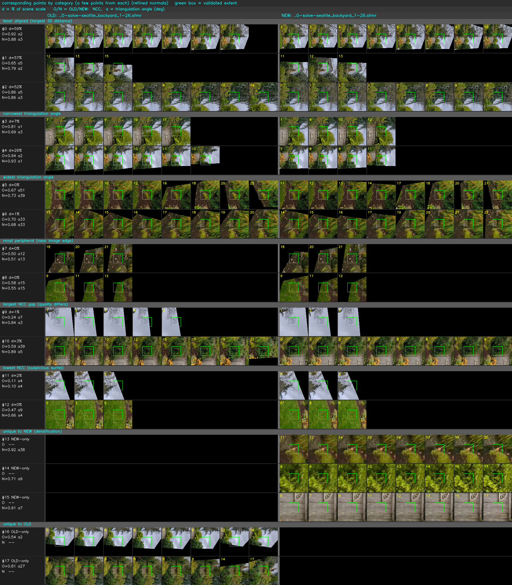
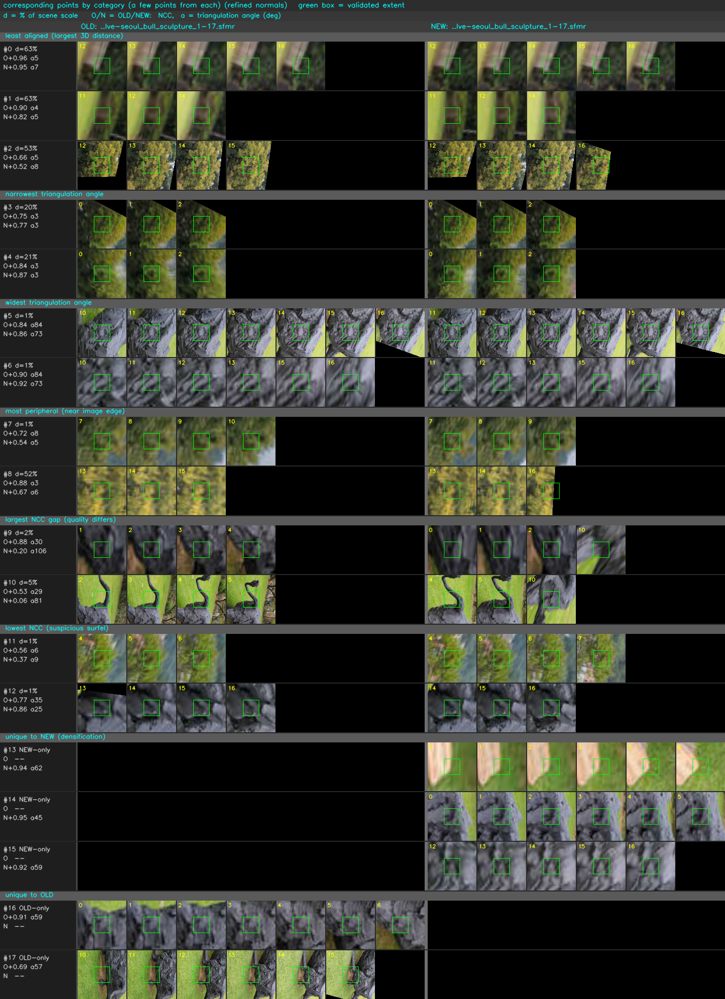
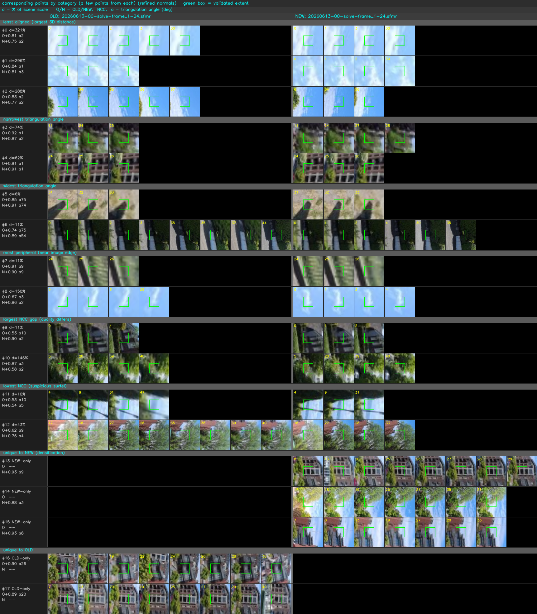
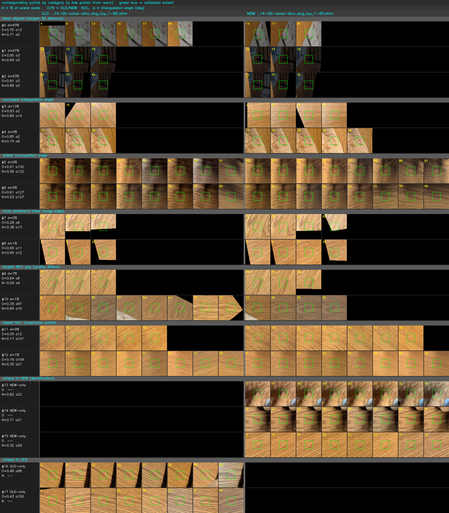

# Old vs new dataset-script solve comparison

_Investigated 2026-06-13._

When the four `scripts/init_dataset_*.sh` pipelines were reworked onto the sfmtool
SIFT backend + track-cluster matching (commit `a683aa9`,
`reports/2026-06-11-dataset-init-scripts.md`), the reconstructions changed. This
note re-runs both the old and new pipeline for **seattle_backyard**,
**seoul_bull**, **kerry_park**, and **dino_dog_toy**, compares each pair with
`sfm compare`, and uses `sfm compare --strips` to *see* where and how the two
solves differ — one **overview montage** per dataset.

Two pieces make the comparison possible:

- **Coordinate-based point matching.** The old and new solves use different SIFT
  backends, so their feature indices don't correspond and the original
  feature-index matching found **zero** common points. `sfm compare` now matches
  3D points by 2D keypoint coordinate (mutual nearest within a pixel threshold,
  voted point-to-point), which works across backends; it auto-selects this when
  every shared image uses a different `.sift` file (override with
  `--by-coordinate` / `--by-feature-index`, `--pixel-threshold`).
- **A scale-independent metric.** SfM is gauge-free, so all residuals are reported
  as a **percentage of scene scale**: the root-mean-square distance of the OLD
  solve's finite 3D points from their centroid. This makes the four datasets
  comparable regardless of each solve's arbitrary scale, and is detailed in
  "Scale-independent metric" at the end.

## What changed between the two pipelines

The rework changed every script the same two ways: the **feature backend** moved
from COLMAP SIFT (with domain-size pooling on some scripts) to the **sfmtool**
extractor, and **matching** moved from the exhaustive pass inside `sfm solve
images/` to a separate `sfm match --cluster` → `.matches` step. The solver and
feature caps were retuned per dataset:

| dataset | OLD: backend / match / solve | NEW: backend / match / solve |
|---|---|---|
| seattle_backyard | COLMAP, cap 250 / exhaustive / global | sfmtool, cap 2000 / cluster / global |
| seoul_bull | COLMAP+DSP / exhaustive / incremental | sfmtool / cluster d=28 / incremental |
| kerry_park | COLMAP+DSP, cap 2000 / exhaustive / global | sfmtool / cluster / global |
| dino_dog_toy | COLMAP+DSP, cap 1000 / exhaustive / global | sfmtool, cap 2500 / cluster / incremental |

The constant across all four is the **feature-backend change**, which is what
makes the solves hard to compare in the first place: different `.sift` files mean
their observations share no feature index.

## Reading an overview montage

Each dataset below is summarized by one `sfm compare OLD.sfmr NEW.sfmr --strips
out.png --strips-labels OLD,NEW` montage. By default `--strips`
shows a few corresponding points from each of several **categories**, each
rendered as a side-by-side patch strip — the **OLD** solve on the left, the
**NEW** solve on the right. (The two inputs are referred to as OLD and
NEW throughout; `--strips-labels OLD,NEW` puts those names on the columns. The
tool's generic default is `reference`/`target` — `RECONSTRUCTION1` is the
alignment reference.)

- **Each tile** is the point's oriented surfel projected into one observing view.
  the default `--strips-context 96` renders a wide window around the point; the
  **green box** marks the point's own (validated) extent.
- **Row label.** `d` = post-alignment distance between the two solves' placement
  of the point (% of scene scale); `O`/`N` = the OLD/NEW solve's patch
  photoconsistency (NCC); `a` = triangulation angle (degrees, small = depth weakly
  constrained by parallax).
- **Sections** (labeled dividers, top to bottom): least aligned, narrowest and
  widest triangulation angle, most peripheral (near the image edge), largest NCC
  gap, lowest NCC, and points **unique** to each solve. A unique point has no
  counterpart, so it renders in one column with the other left blank (`NEW-only` /
  `OLD-only`).

What to look for: do the two columns show the **same texture** (both solves found
the same surface)? Does the disagreement `d` track small `a` (parallax-starved
points)? Are there rows where one solve's NCC is high and the other low (a
genuine quality difference)? And how large/clean is the **unique-to-NEW** block
(the densification)?

Points at infinity (`w = 0`, e.g. distant sky one solve parks at infinite depth)
have no finite surfel and are excluded from the montage and the distance stats.

## The four datasets

### seattle_backyard

26 images. OLD 521 points, NEW 3253; 354 correspond (167 unique to OLD, **2899
unique to NEW**). The cameras nearly agree (`compare`: VERY SIMILAR; median
position error 0.24% of scene scale, rotation 0.16°).



The least-aligned and narrow-angle rows are foliage: the two columns show the
same leaves and the per-solve NCC stays high, so both solves found the same
surface and placed it a little differently — a placement difference, not a garbage
point. The widest-angle rows agree (`d≈0`). The **unique-to-NEW** block is large
and its strips are clean, consistent surfels. The headline difference is this
densification, not disagreement on shared structure (92% of corresponding pairs
agree within 10% of scene scale).

### seoul_bull

17 images. OLD 1078, NEW 1043; 485 correspond (593 unique to OLD, 558 unique to
NEW). Here the cameras diverge more (`compare`: SIGNIFICANT, median position error
1.0% of scene scale), and density is balanced rather than seattle_backyard's ~6×
densification: the difference is which ~550 points each solve keeps.



The widest-angle rows are the **metal sculpture surface** and agree (`d≈1%`); the
narrowest-angle rows are **background foliage** and disagree (`d` of tens of
percent). The unique-to-each blocks are similar in size, consistent with the
balanced counts.

### kerry_park

48-image, two-sensor 360° fisheye rig of the Seattle skyline. OLD 1192, NEW 761;
374 correspond (13 of them at infinity — counted as correspondences but excluded
from the distance stats; 818 unique to OLD, 387 to NEW). The solves **do not align
well**: the best similarity needs a ~5× scale change (scale 0.20), the camera
centers still miss by a median 6.6%, though the rotations agree (0.21°).



The least-aligned rows are **sky** (uniform blue, no parallax) — features the two
solves triangulate to very different depths. Unlike the other datasets, the
disagreement does **not** vanish at wide angle (see the table below); the two
solves estimated different fisheye **distortion** (camera 0's radial `k2` is
−0.0195 vs −0.0339), which would shift triangulated depths in a way a single
similarity cannot absorb — consistent with the residual. The `largest NCC gap`
rows are few and small, so the difference is geometric, not one solve placing
photometrically-bad points.

### dino_dog_toy

85 images orbiting a toy on a patterned surface. OLD 5339, NEW 19033; 3355
correspond (1984 unique to OLD, **15678 unique to NEW**). Cameras agree (VERY
SIMILAR; median position error 0.42%, rotation 0.16°); intrinsics are close
(SIMPLE_RADIAL, focal differs 0.34%).



Because it is an orbit capture, most points are well triangulated — the
widest-angle rows span opposite sides of the orbit (`a` up to 132°) and agree at
`d≈0`. The headline is again density: the NEW cloud is ~3.6× the OLD (the
**unique-to-NEW** block alone is ~2.9×), and it renders as clean surfels. This is
the tightest overall agreement of the four.

## Triangulation angle vs. disagreement

Every per-dataset read above turns on one axis — triangulation angle — and it
behaves consistently. Median post-alignment distance (% of scene scale) by angle
bucket:

| dataset | corr(angle, dist) | <2° | 2–5° | 5–15° | >15° |
|---|--:|--:|--:|--:|--:|
| seattle_backyard | −0.31 | 8.3% | 2.0% | 0.6% | 0.2% |
| seoul_bull | −0.41 | — | 16% | 1.9% | 0.9% |
| kerry_park | −0.33 | 52% | 40% | 26% | 11% |
| dino_dog_toy | −0.18 | 6.1% | 2.6% | 0.7% | 0.4% |

(seoul_bull has no corresponding points below 2°.) Two patterns appear:

- **seattle_backyard, seoul_bull, and dino_dog_toy** — at wide angle (>15°) the
  two solves agree to a median 0.2–0.9% of scene scale. Where parallax constrains
  depth they essentially coincide; the disagreement is confined to the
  parallax-starved points, and the headline difference is density. dino_dog_toy,
  an orbit capture, is the best triangulated and agrees most tightly.
- **kerry_park** — even the widest-angle points keep a median ~11% floor that
  parallax does not remove, consistent with the differing fisheye distortion. The
  other three show no such floor.

## Scale-independent metric

SfM is gauge-free: a scene reconstructed 100× larger is the same reconstruction,
so a comparison metric should not change. `compare` aligns the NEW solve onto the
OLD one with a similarity transform (which removes the scale gauge), but the
residual distances still come out in the OLD solve's arbitrary units — so absolute
thresholds were meaningless, and kerry_park's raw "median move 14" was
uninterpretable.

`compare` reports every alignment residual — both camera position errors and
3D-point distances — **as a percentage of scene scale**: the root-mean-square
distance of the OLD solve's finite 3D points from their centroid. The
relationship conclusion `IDENTICAL` / `VERY SIMILAR` / `SIGNIFICANT` uses
relative thresholds. The
metric is invariant to each solve's gauge: comparing a reconstruction to a
100×-scaled copy of itself yields identical percentages (regression-tested in
`tests/test_compare.py`). Camera *rotation* errors were already scale-free
(degrees) and are unchanged.

## Reproduce

```bash
# OLD vs NEW pipeline (seattle_backyard flags shown; see the table above for the
# per-dataset backend / matcher / solver).
sfm ws init old_ws && sfm sift --extract old_ws/images/*.jpg
sfm solve --global --max-features 250 --seed 42 old_ws/images/

sfm ws init --feature-tool sfmtool --max-features 2000 new_ws
sfm sift --extract new_ws/images/*.jpg
sfm match --cluster new_ws/images/ -o new_ws/tvg-matches/x.matches
sfm solve --global --seed 42 new_ws/tvg-matches/x.matches

# Compare, and render the overview montage (the default --strips mode).
# --strips-labels names the two columns (the figures above use OLD/NEW).
sfm compare old_ws/sfmr/OLD.sfmr new_ws/sfmr/NEW.sfmr \
    --strips overview.png --strips-labels OLD,NEW

# Or focus on a single axis instead of the sampler (--strips-end high|low picks
# the end; default is the axis's natural end):
sfm compare OLD.sfmr NEW.sfmr --strips x.png \
    --strips-rank view-angle --strips-end low
# axes: distance | view-angle | ncc | ncc-gap | image-radius | feature-size | world-size
```
